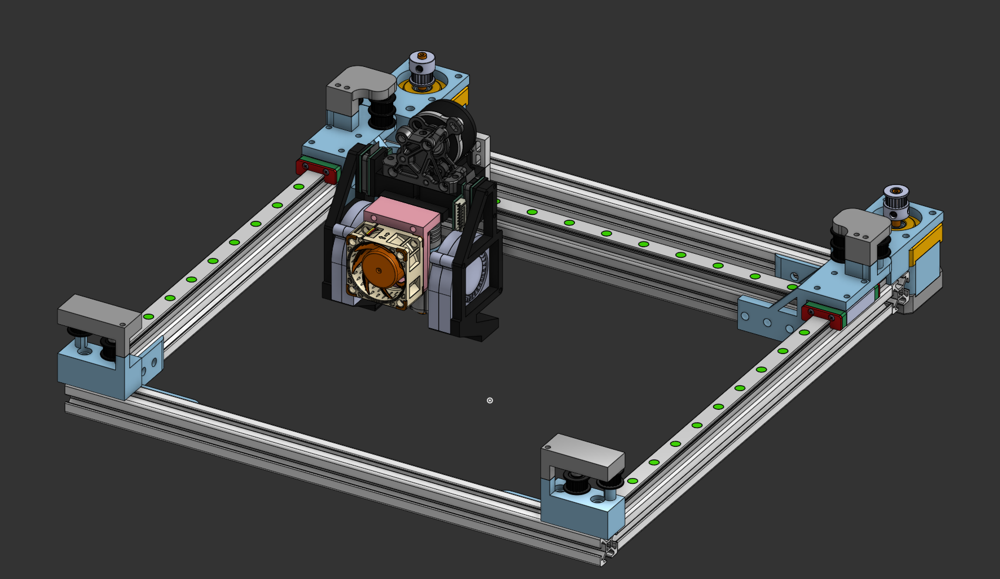

# XT-1

A modular CoreXY 3D Printer with a focus on repairability.

| [READ THE JOURNAL](./JOURNAL.md) | [READ CAD CREDITS](CAD_CREDITS.md) |
| -------------------------------- | ---------------------------------- |

## IMPORTANT

- The JST PH connectors from the T-plugs to the supp. board need to have reverse connectors!

## Gallery

